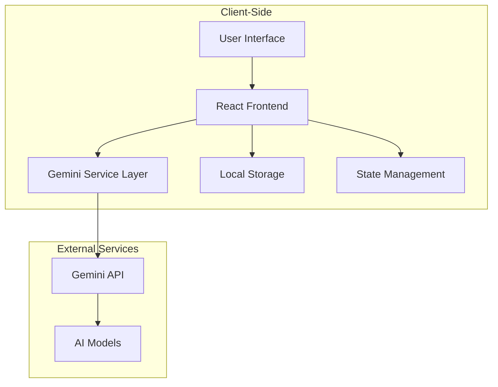

# 🧠 AI Study Assistant

An intelligent study companion powered by Google's Gemini AI that helps students learn efficiently through topic summarization, quizzes, flashcards, and personalized study tips.


## 📋 Table of Contents
- [Features](#-features)
- [Architecture](#-architecture)
- [Tech Stack](#-tech-stack)
- [Getting Started](#-getting-started)
- [Project Structure](#-project-structure)
- [Development](#-development)
- [Deployment](#-deployment)
- [Author](#-author)

## 🌟 Features

- **AI-Powered Learning**: Get concise summaries of any topic in 3 bullet points
- **Interactive Quizzes**: Test your knowledge with auto-generated MCQs
- **Digital Flashcards**: Reinforce learning with flip-style flashcards
- **Personalized Study Tips**: Receive tailored advice for effective studying
- **Math Mode**: Solve quantitative and logic problems with step-by-step solutions
- **Streaming Responses**: Real-time response generation for better UX
- **Local Storage**: History of recently studied topics
- **Responsive Design**: Works on all device sizes

## 🏗️ Architecture

The AI Study Assistant follows a client-side architecture leveraging Google's Gemini AI for all intelligence capabilities:



### Core Components

1. **Frontend Layer (React + TypeScript)**
   - Main Application Component ([App.tsx](frontend/App.tsx))
   - UI Components (ErrorMessage, LoadingSpinner, Icons)
   - State Management (useState, useEffect hooks)
   - Responsive UI with Tailwind CSS

2. **Service Layer**
   - Gemini AI Integration ([geminiService.ts](frontend/services/geminiService.ts))
   - Streaming Response Handling
   - JSON Schema Validation
   - Error Handling

3. **Data Layer**
   - TypeScript Types ([types.ts](frontend/types.ts))
   - Local Storage for Topic History
   - In-memory State Management

4. **Build System**
   - Vite for Fast Development and Building
   - TypeScript Compilation
   - Module Bundling

### Data Flow

1. User enters a topic and selects study mode (normal/math)
2. Request is sent to Gemini service with structured prompt
3. Gemini API processes request using specialized models
4. Streaming response is received and parsed as JSON
5. Data is rendered in appropriate UI components
6. Topic history is saved to local storage

## 🛠️ Tech Stack

- **Frontend**: React 19, TypeScript, Tailwind CSS
- **Build Tool**: Vite 6
- **AI Service**: Google Gemini API (@google/genai)
- **State Management**: React Hooks
- **Storage**: LocalStorage API
- **Deployment**: Vercel (or similar static hosting)

## 🚀 Getting Started

### Prerequisites

- Node.js (v16 or higher)
- npm or yarn
- Google Gemini API Key

### Installation

1. Clone the repository:
   ```bash
   git clone <repository-url>
   cd ai-study-assistant
   ```

2. Install dependencies for both frontend and backend:
   ```bash
   npm run install:all
   ```

3. Create a `.env.local` file in the `frontend/` directory:
   ```env
   API_KEY=your_google_gemini_api_key_here
   ```

4. Start both frontend and backend servers:
   ```bash
   npm start
   ```

5. Open your browser to `http://localhost:3000`

## 📁 Project Structure

```
ai-study-assistant/
├── frontend/
│   ├── components/
│   │   ├── ErrorMessage.tsx      # Error display component
│   │   ├── LoadingSpinner.tsx    # Loading indicator
│   │   └── icons.tsx             # SVG icon components
│   ├── services/
│   │   └── geminiService.ts      # Gemini API integration
│   ├── App.tsx                   # Main application component
│   ├── index.tsx                 # Entry point
│   ├── types.ts                  # TypeScript type definitions
│   ├── vite.config.ts            # Vite configuration
│   └── package.json              # Frontend dependencies and scripts
├── backend/
│   ├── src/
│   │   ├── controllers/          # Request handlers
│   │   ├── routes/               # API route definitions
│   │   ├── middleware/           # Custom middleware functions
│   │   ├── models/               # Data models
│   │   ├── utils/                # Utility functions
│   │   └── server.js             # Main server file
│   ├── package.json              # Backend dependencies and scripts
│   └── README.md                 # Backend documentation
├── package.json                  # Root package.json for managing both frontend and backend
└── README.md                     # This file
```

## 🧪 Development

### Available Scripts

- `npm run frontend` - Start frontend development server
- `npm run backend` - Start backend development server
- `npm start` - Start both frontend and backend servers concurrently
- `npm run install:all` - Install dependencies for root, frontend, and backend
- `npm run build` - Build frontend for production

### Adding New Features

1. For frontend features:
   - Create components in the `frontend/components/` directory
   - Extend types in `frontend/types.ts` as needed
   - Add new services in the `frontend/services/` directory
   - Update the main `frontend/App.tsx` to integrate new functionality

2. For backend features:
   - Add controllers in `backend/src/controllers/`
   - Define routes in `backend/src/routes/`
   - Add middleware in `backend/src/middleware/`
   - Update `backend/src/server.js` to register new routes

## ☁️ Deployment

### Frontend Deployment

1. Build the frontend application:
   ```bash
   cd frontend
   npm run build
   ```

2. Deploy the `frontend/dist/` folder to any static hosting service:
   - Vercel
   - Netlify
   - GitHub Pages
   - Firebase Hosting

Ensure your `API_KEY` environment variable is set in your deployment environment.

### Backend Deployment

1. Deploy the backend to any Node.js hosting service:
   - Heroku
   - Render
   - AWS EC2
   - DigitalOcean App Platform

2. Set the required environment variables in your deployment environment.

## 👨‍💻 Author

**Name:** Soham Pal  
**Role:** Developer & AI Engineer  
**Institution:** Polaris School of Technology, Bangalore  
**Specialization:** B.Tech in CSE (AI & ML)  
**GitHub:** [SOHAMPAL23](https://github.com/SOHAMPAL23)  
**LinkedIn:** [Soham Pal](https://www.linkedin.com/in/soham-pal-075157310/)